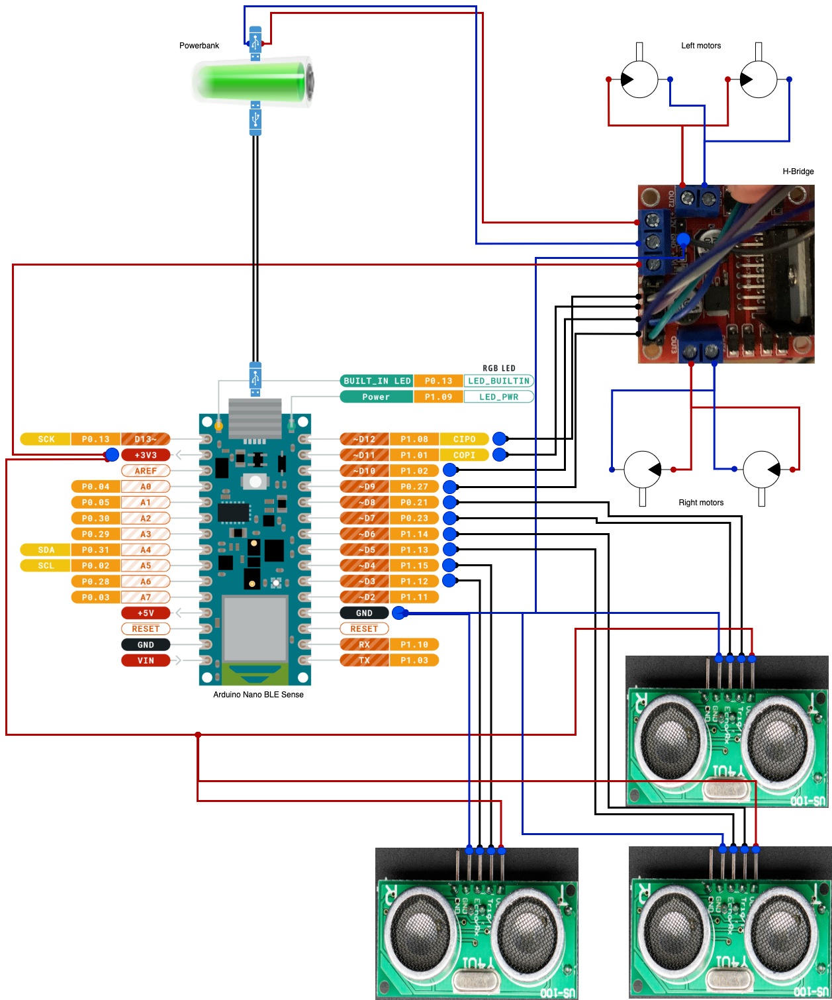

# Round One
You have the parts, you have the courage and you will get pizza.

You should've been given the following:
* 4 motors
* A chassis + some nuts & bolts + wheels
* A bunch of wires
* A big breadboard and a small breadboard
* An H-bridge (the little red thing, with the heat-sink on top)
* An Arduino Nano 33 BLE Sense (this is the main board, that you'll be programming)
* A power bank
* A regular USB-A to Micro USB cable (you'll use this to connect the arduino to the power bank)
* A USB-A to pins cable (you'll use this to connect the power bank to the H-bridge, thus powering the motors)


## The task!
To complete **Round One**, your task is to build a robot, that can compete against it's fellow creations on a regular old race track. It won't be all on it's own, as one of you will need to volunteer for the task of remote controller it, when we get to it.

But, before we get to that part, we need to assemble the robot. I suggest you proceed in, roughly, as follows:
* Check that all your motors work (you could do this by wiring your battery directly to the motors on your bread board)
* Assemble the circuit
* Write a little program that make the motors do something (maybe run for a few seconds, stop, then repeat)
* Build your robot
* And then you're ready to create the program that will make it make you able to control it!

## An arduino crash course
The arduino is a small board, that consists of a programmable micro controller and some bells and whistles, that ensure that we don't fry the micro controller due to faulty wiring.

The Arduino has a number of **pins**. Pins are the metal connectors situated on the periphery of the board, and they allow us to read from sensors and write to actuators. In this first round, we will only concern ourselves with digital pins, i.e. pins that can have one of two values, and we're only gonna be using them for writing.

The two values that are pin can take are, **HIGH** or **LOW**. Setting a pins value to **HIGH** means that it will connect whatever is connected to it to the positive terminal of the arduinos circuit, whereas setting it to **LOW** means that it will connect it to the negative terminal, or ground.
If we have a lamp, we can wire the lamp to ground and a pin of our choosing, and control whether the lamp is on, by setting the pin to either **HIGH** or **LOW**. If we set the pin to **HIGH** one wire from the lamp will be connected to the positive terminal and the other to ground, creating a circuit with a current across it with the lamp in the middle. This will make our lamp light up. If we set it to **LOW**, this will make both the wires coming from our lamp connect to ground, placing the lamp in a circuit with no voltage across it, leaving us in the dark.

## A simple arduino program

TODO: Add description of how to upload the program to the thing

Copied from [the Arduino homepage](https://docs.arduino.cc/built-in-examples/basics/Blink)
```c++
// the setup function runs once when you press reset or power the board
void setup() {
  // initialize digital pin LED_BUILTIN as an output.
  // LED_BUILTIN refers to the PIN of the builtin LED of the arduino
  pinMode(LED_BUILTIN, OUTPUT);
}

// the loop function runs over and over again forever
void loop() {
  digitalWrite(LED_BUILTIN, HIGH);  // turn the LED on (HIGH is the voltage level)
  delay(1000);                      // wait for a second
  digitalWrite(LED_BUILTIN, LOW);   // turn the LED off by making the voltage LOW
  delay(1000);                      // wait for a second
}
```

## Motor circuit
We're not interested in lamps, though. We're interested in motors. Electric motors are contraptions made possible by the wonders of electromagnetism. Relying on electromagnetism, however, causes the motors to sometimes create some voltage spikes, outside of the range of the arduino's operating range. The motors that we're using will not create voltages that are dangerous to large mammals, but they might damage the brittle innards of our micro controller. For this reason, we will put a little circuit in between the arduino and the motors. This circuit is the H-Bridge, and it will insulate the arduino's circuit from the circuit that supplies current to the motors.

Here's an overview of what the circuit that ties all these things together:



That's it (for the circuit).

## A less simple program
TODO: Add a program here for the motors.

## Remote controlling
TODO: Describe bluetooth in broad terms

TODO: Add program outline for bluetooth, not whole thing

```c++

```